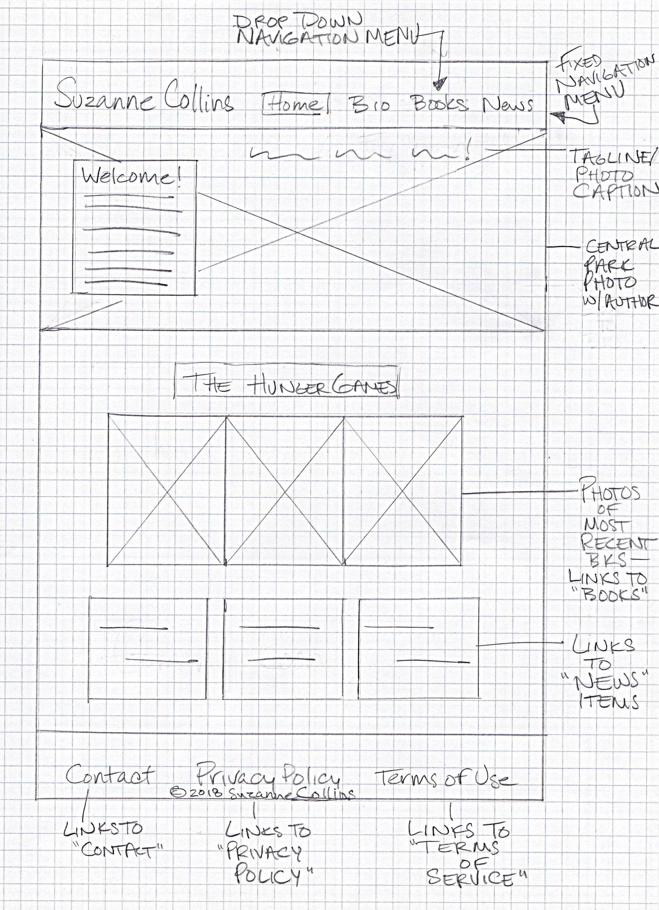

# My INF 7420 Project

I am going to redesign an author profile page. The main purpose of this project will be to improve the existing website for author Suzanne Collins.

## Wireframes

I value planning, so here are some wireframes to show possible site architecture and layout.

### **Home Page:**

Header - will include the navigation menu and author's name

Navigation Menu - will include links to main pages

Main Content - will include a welcome message from the author along with links to most recent books and news stories

Footer - will include links to contact info, privacy policy, and terms of service, along with copyright info

### **Bio Page:**

Main Content - will include a bio and photo of the author, along with links to print interviews and embedded video interviews

### **Books Page:**

Main Content - will include info on the upcoming book release, as well as tiled book cover photos with short blurbs that link to individual book pages
